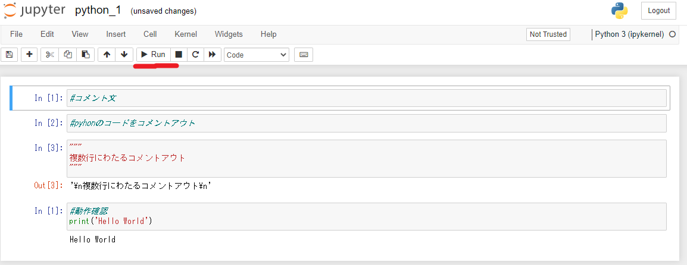
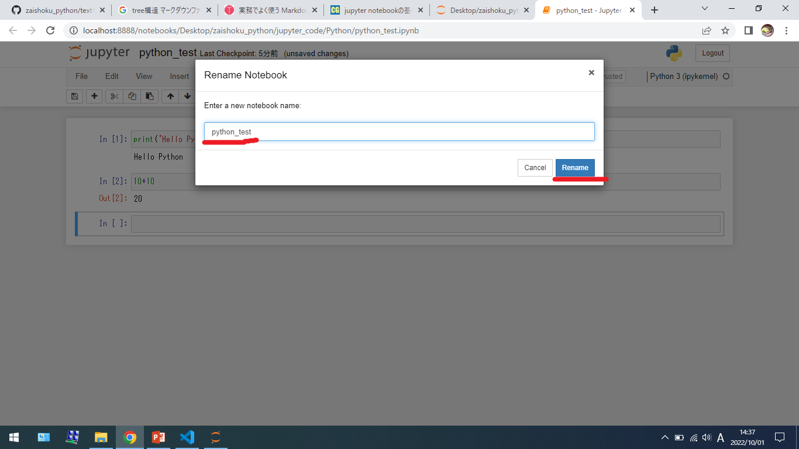

# プログラミング技術（Python入門）

## 統合開発環境（IDE）について（Jupyter NoteBook）

Python言語の基本を学習するために、Webブラウザ上で動作するWebアプリケーションのJupyter NoteBookを使用します。Jupyter Notebookとは、機械学習などのデータ分析に使用されることを想定されており、データの可視化などの作業に適しています。対話型の開発環境であるため結果が直ぐに出力されるので、実行結果やグラフの描画などビジュアル面が充実しています。また、前の実行結果に応じて、次に実行するプログラムや作業を選択することができます。現在は開発が進み、Pythonだけでなく、RubyやGo言語なと多くの言語がサポートされています。


Jupyter Notebookはオープンソースであり、無償利用が可能です。また、Numpy、Pandasなどの科学計算やデータ解析、機械学習を行うライブラリもすでにインストール済みで、すぐに始められます。

## 環境構築の準備

Jupyter NoteBookを利用するには、以下の２つがあります。今回は、Anacondaを使ったインストールを行います。

* pipコマンドを使ったインストール
* Anacondaを使ったインストール

以下のアドレスからAnacondaをダウンロードし、インストールします。

* <https://www.anaconda.com/products/distribution>

## Jupyter NoteBookの使い方 

### Jupyter NoteBookの起動

WindowsのスタートメニューからAnaconda3の中のJupyter NoteBookをクリックし、起動します。


ターミナル画面が立ち上がり、起動します。


ご自身のPC内のディレクトリから開きたいファイル（拡張子：`.ipynb`）をクリックします。画像は、今回使用するフォルダの構造を参照しています。`python_1.ipynb`を開いてみてください。

フォルダの階層
```
zaishoku_python
|---jyupter_cone
|       |---Matplotlib
|       |---Numpy
|       |---Pandas
|       |---Python
|            |---python_1.ipynb
|---pico_code
```


ファイル名をクリックと同時にファイルが`Running`状態となり、ファイルが開かれ、プログラムが実行できるようになります。

### プログラムの実行

Running状態のコードを`[▶Run]`をクリックすると、cellごとにプログラムを実行することができます。`In[数値]`は、実行するプログラムのコードのcellになり、`Out[数値]`は、`In[]`のcellに対しての実行結果になります。また、クリックごとに下のcellに移動し、それぞれの`In[]`が`Out[]`のcellとして実行されていきます。プログラムに問題があれば、`Out[]`のcellにエラーが書かれます。



### 新規ファイルの作成

NeWをクリックし、インタプリタを`[Python3(ipykernel)]`を選択します。


以下のコードを画像のように入力して、コードを実行してください。

```python
In[] : print('Hello Python')
```
```python
In[] : 10 + 10
```


以下は、コードに間違いがあるときのエラーを表示させたものです。初心者の方がよくミスをするエラーです。

```python
In[] : print(Hello Python)
```
```python
In[] : 10 + a
```


* Pytohnの構文エラー
    * pythonの文法が間違っています。

```shell
SyntaxError:   invalid syntax
```

* 定義されていないエラー
    * 'a'という名前が定義されていません。

```shell
NameError:  name 'a' is not defined
```

入力および実行が終わったら名前を付けて保存します。`Untitled`をクリックし、任意の名前を入力してください。



### Jupyter NoteBookの終了

上記タブのFileから[close and Halt]をクリックして、Webブラウザを終了し、ターミナル画面上で`[ctrl+cキー]`を押すと、数秒後に終了します。


