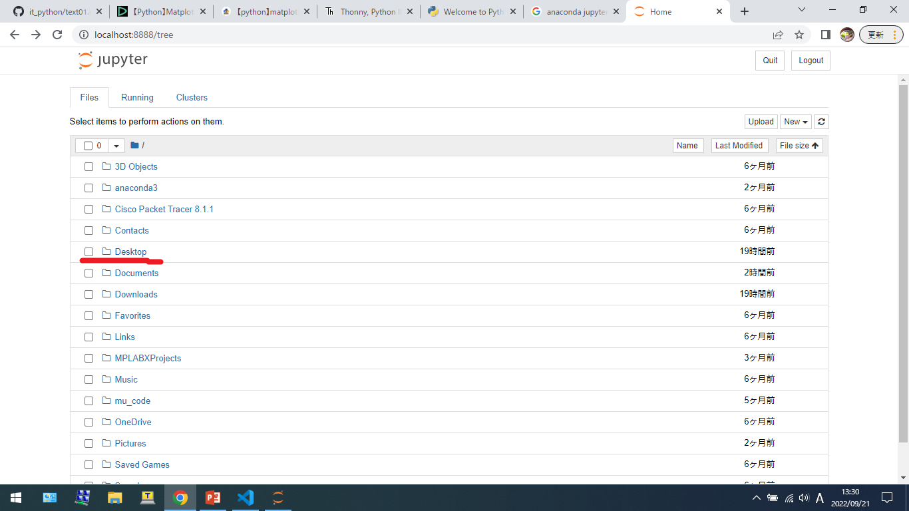
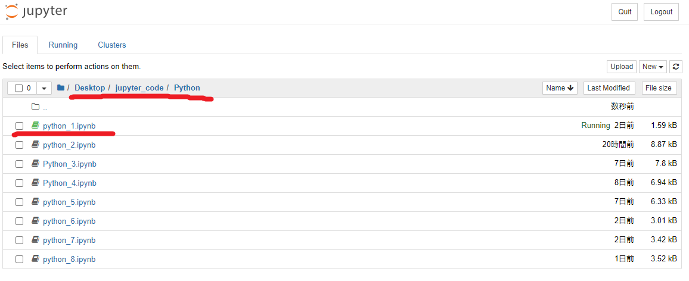

# プログラミング技術（Python入門）

## 統合開発環境（IDE）について（Jupyter NoteBook）

Python言語の基本を学習するために、Webブラウザ上で動作するWebアプリケーションのJupyter NoteBookを使用します。Jupyter Notebookとは、機械学習などのデータ分析に使用されることを想定されており、データの可視化などの作業に適しています。対話型の開発環境であるため結果が直ぐに出力されるので、実行結果やグラフの描画などビジュアル面が充実しています。また、前の実行結果に応じて、次に実行するプログラムや作業を選択することができます。現在は開発が進み、Pythonだけでなく、RubyやGo言語なと多くの言語がサポートされています。

Jupyter Notebookはオープンソースであり、無償利用が可能です。また、Numpy、Pandasなどの科学計算やデータ解析、機械学習を行うライブラリもすでにインストール済みで、すぐに始められます。

## 環境構築の準備

Jupyter NoteBookを利用するには、以下の２つがあります。今回は、Anacondaを使ったインストールを行います。

* pipコマンドを使ったインストール
* Anacondaを使ったインストール

以下のアドレスからAnacondaをダウンロードし、インストールします。

* <https://www.anaconda.com/products/distribution>

## Jupyter NoteBookの起動

WindowsのスタートメニューからAnaconda3の中のJupyter NoteBookをクリックし、起動します。

コンソール画面が立ち上がり、起動する。

ご自身のPC内のディレクトリから開きたいファイル（拡張子は：`.ipynb`）をクリックする。

クリックと同時にファイルがRunning状態となり、プログラムが実行できるようになります。

