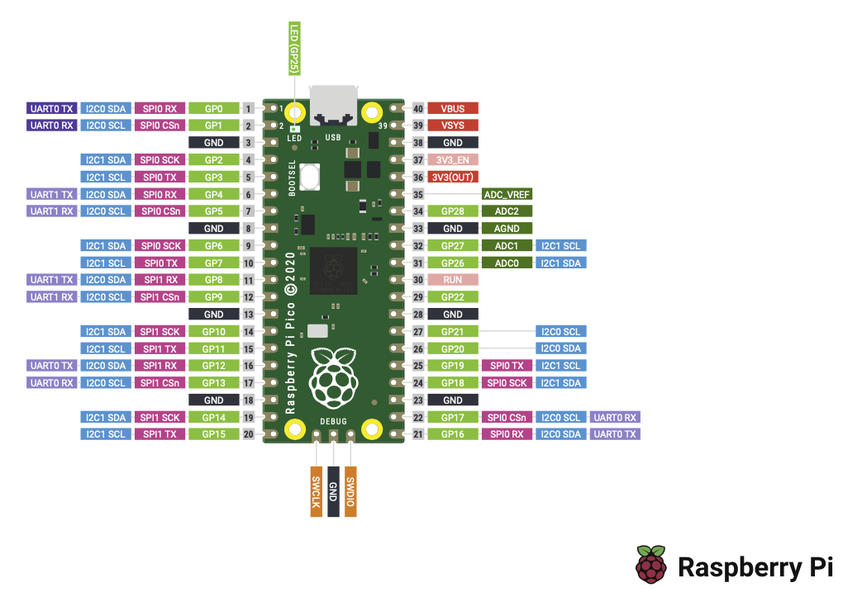
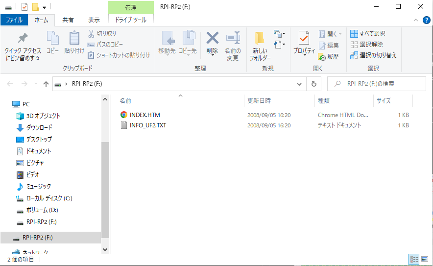
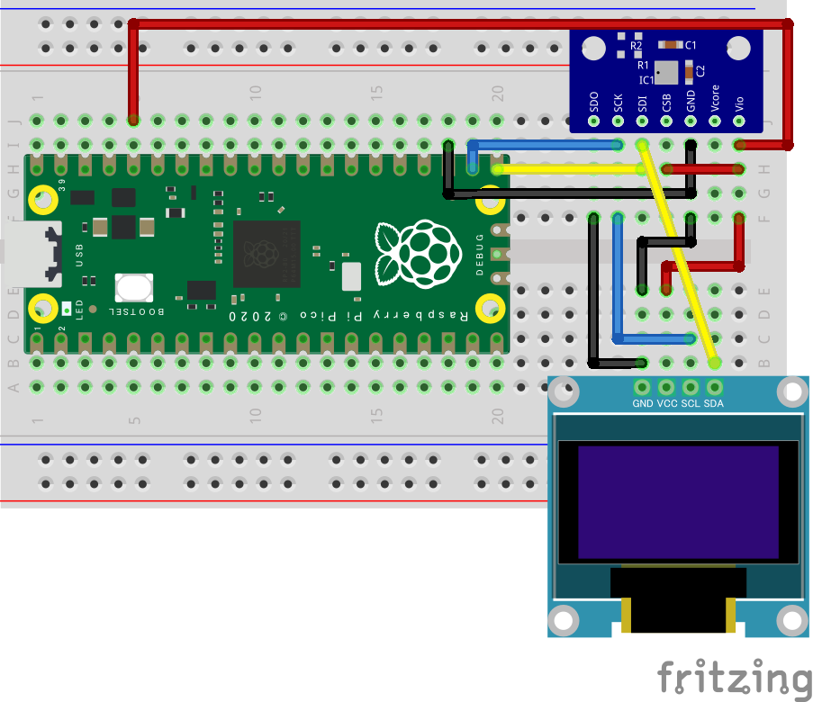
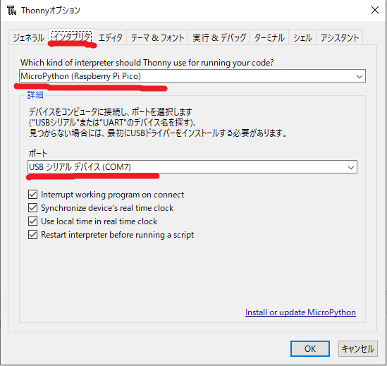
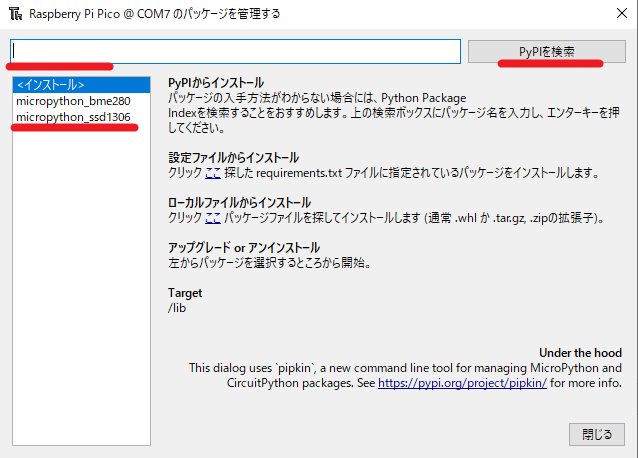
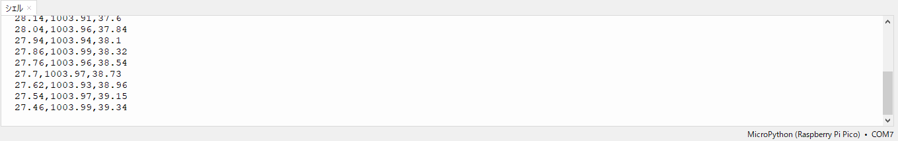

# プログラミング技術（Python入門）

## Raspberry Pi Picoについて

Raspberry Pi財団が独自に開発したARM Cortex M0+デュアルコアのRP2040マイコンを搭載した開発基板です。C/C++およびMicroPythonで開発が可能です。既存のRaspberry Piとは異なりLinux OSは搭載できません。

### [主な特徴](https://www.raspberrypi.com/products/raspberry-pi-pico/)

* Paspberry Pi設計のRP2040マイコン搭載
* USBを介しマスストレージを使ったドラッグアンドドロップによるプログラムの書き込みが可能
* USB 1.1 ホスト/デバイス両対応
* 低消費電力スリープモードおよびドーマントモードが利用可
* C/C++及びPython3ベースの組み込み用MicroPython言語による開発が可能
* 温度センサが搭載

### 仕様

- RP2040（デュアルコア ARM Cortex M0+プロセッサ）
- 最大動作周波数 133 MHz
- SRAM：264KB
- フラッシュメモリ：2MB
- インターフェース
    - GPIO x 26pin
    -  SPI x 2
    - I2C x 2
    - UART x 2
    - 12 bit ADC x 3
    - PWM x 16
    - プログラマブルI/Ox 8

### ピン配置

ピンレイアウトは下図の通りとなる。



### [Raspberry Pi Picoの環境構築](https://www.raspberrypi.com/documentation/microcontrollers/micropython.html)

Rapberry Pi Pico用のUF2ファイルをダウンロードする。（Pico WはWi-Fiモジュール搭載用なので間違わないようにすること。※日本未発売R4.9.22現在）

* BOOTSELボタンを押したまま、PicoをPCのUSB ポートに接続します。Picoが接続されたら、BOOTSELボタンを放します。

* RPI-RP2と呼ばれるマスストレージデバイスとしてマウントされます。



* MicroPython UF2ファイルをRPI-RP2ボリュームにドラッグ＆ドロップします。Picoが再起動します。

### 配線

配線図は以下の図及び表にならって、配線します。



| Pico | pin| SSD1306 | BME280 |
| --- | --- | --- | --- |
| 3V3(OUT) | 36 | VCC | VDD |
| GND | 23 | GND | GND |
| SCL | 22 | SCL | SCK |
| SDA | 21 | SDA | SDI |
| 3V3(OUT) | 36 | --- | CSB |
| GND | 23 | --- | SDO |


## MicroPython用開発環境Thonnyについて

Raspberry Pi向けのPython開発環境Thonnyは、初心者向けの統合開発環境であり、最新のRaspberry Pi OSに標準でインストールされています。

### MicroPythonとは

マイクロコンピュータや組み込み機器で使われるプログラミング言語はC/C++が一般的ですが、初心者にとっては学習障壁が比較的高い言語でもあります。`「MicroPython」`はPython3と高い互換性があるプログラミング言語であるため、プログラミング初心者でも理解しやすいPythonの文法を使ってプログラミングすることができます。

* MicroPython - Python for microcontrollers
    * <http://micropython.org/>


### インタプリタの選択

ツール＜オプション からインタプリタの設定画面を開く。

- Which kind of interpreter...code?
    - MicroPython(Raspberry Pi Pico)
- ポート
    - USBシリアルデバイス（自身のCOM番号）
- OK

)

## サンプルプログラム

いつくかのサンプルプログラムを実行し、Picoと各種センサについて学習します。

### LEDの制御

Raspberry Pi Picoに内臓されているLED（GPIO25pinに接続）を使用して、Lチカを行います。

* ファイル名（pico_micropython1.py）
```python
# pico_micropython1.py
# -*- coding: utf-8-*-
#pico用ライブラリをインポート
from machine import Pin
#timeライブラリをインポート
from time import sleep

#picoのled(GPIO25を出力ピンに定義)
led = machine.Pin(25, machine.Pin.OUT)

#無限ループ
while True:
    led.value(1) #led点灯
    sleep(1)	 #1min待機
    led.value(0) #led消灯
    sleep(1)
```

### ライブラリのインストール

OLED及びAE-BME280をMicroPythonで開発する際に便利なライブラリがあるのでダウンロードする。

ツール＜パッケージを管理...、`ssd1306`で検索する。
- micropython_ssd1306
    - `https://github.com/stlehmann/micropython-ssd1306`

ツール＜パッケージを管理...、`bme280`で検索する。
- micropython_bme280
    - `https://github.com/stlehmann/micropython-ssd1306`



### OLEDの表示

有機ELディスプレイ（OLED）をPicoにI2C接続を行い、文字を表示します。

* ファイル名（pico_micropython2.py）

```python
# -*- coding: utf-8-*-
# pico_micropython2.py
#pico用ライブラリをインポート
from machine import Pin, I2C
#timeライブラリをインポート
from time import sleep
#ssd1306ライブラリをインポート
import ssd1306

#I2C通信の設定(16pinをsdaに, 17pinをscl)
i2c = I2C(0, sda = Pin(16), scl = Pin(17), freq = 40000)
#OLEDの初期設定
oled = ssd1306.SSD1306_I2C(128, 64, i2c)

oled.text("Rasp Pi Pico",0,0)  #x=0, y=0座標に文字を出力
oled.text("Hello Python",0,20) #x=0, y=20座標に文字を出力

oled.show()		#oledにデータを表示
```
### BME280センサデータの取得

BME280センサをPicoにI2C接続を行いデータを取得する

* ファイル名（pico_micropython3.py）

```python
# -*- coding: utf-8-*-
# pico_micropython3.py
#pico用ライブラリをインポート
from machine import Pin, I2C
#timeライブラリをインポート
from time import sleep
#bme280ライブラリをインポート
from bme280 import BME280

import math

#I2C通信の設定(16pinをsdaに, 17pinをscl)
i2c = I2C(0, sda = Pin(16), scl = Pin(17), freq = 40000)
#BME280の初期設定
bme = BME280(i2c = i2c)

'''
bme280センサの計測を行う関数
'''
def sensor():
    temp, press, humi = bme.read_compensated_data()
    #温度,湿度,気圧のデータを計算
    temp = float(temp / 100)
    press = float((press // 256) / 100)
    humi = float(humi / 1024)
    #文字型に変換してlist型dataに格納
    #humiを小数点以下第二位で四捨五入
    data = str(temp) + ',' + str(press) + ',' + str(round(humi, 2))
    #計測したデータを戻り値として返す
    return data, temp, press, humi

while True:
    #sensor関数を呼び出し、戻り値をdata,temp,press,humiに格納
    data, temp, press, humi = sensor()
    
    print(data)  #シリアル通信にてデータ送信
    sleep(1)	 #1min待機
```
正しく接続ができていれば、以下のようなセンサデータがshell画面に1秒間隔で表示されます。


