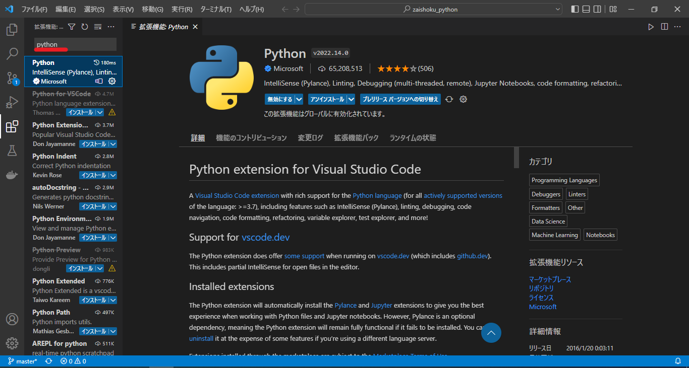
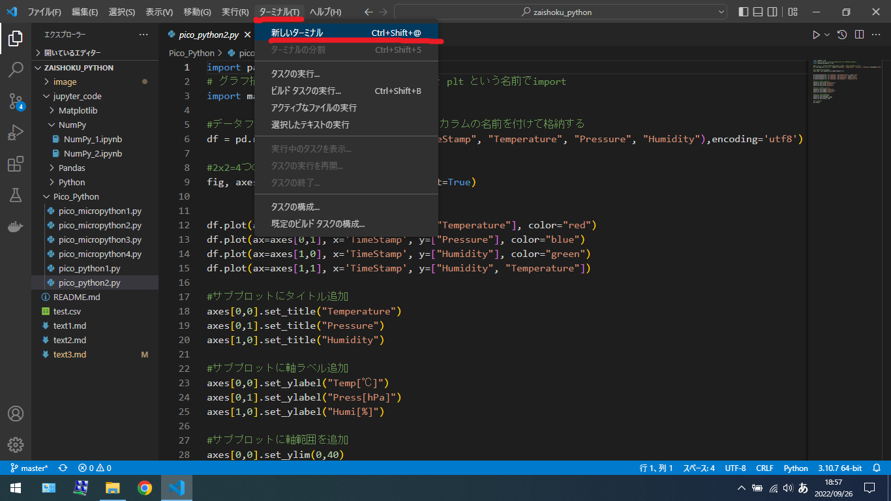

# プログラミング技術（Python入門）

## 統合開発環境（IDE）について（Visual Studio Code)

Visual Studio Code（VSCode）は、2015年にリリースされたMicrosoftが提供する開発用エディタです。ほぼ全ての言語に対応しており、かつオープンソースであるため、無償で使えます。Windows、Mac、LinuxなどのOSにも対応しています。


## 環境構築の準備

以下のアドレスからVSCodeをダウンロードし、インストールします。

* https://code.visualstudio.com/download

## Pythonの準備

VSCode内のプライマリサイドバーの拡張機能から`Python`と検索し、Pythonの開発に必要な拡張機能をインストールします。その他Pylanceなどの機能も一緒にインストールされる。



インタプリタをPython3.?.? 64-bit ~/anaconda3/python/exeを選択する。この際、Anaconda環境以外のPython開発環境をPCにインストールされている場合は、別のPythonインタプリタが競合する場合があります。慣れていない方は、PCのアプリケーションのアンインストールから削除することをおすすめします。


## ライブラリのインストール作業

Raspberry Pi Picoとシリアル通信にてデータを受信するには、`Pyserial`ライブラリをインストールする必要があるので、インストールする。

Windowsスタートメニュー＜Anaconda3(64-bit)＜Anaconda Powershell Promptでshellを開く



shellが画面にて以下のコマンドを打つ。

- pipを最新版にアップデート

```shell
(base) PS C:\Users\user> pip install --upgrade pip
```
`Successfully uninstalled pip-21.2.4`とでれば成功
 
- Pyserialをインストール

```shell
(base) PS C:\Users\user> pip install pyserial 
```
`Successfully installed pyserial-3.5`とでれば成功

## Rasberry Pi Picoからシリアル通信にて送信する

以下のプログラムを実行した後、Thonnyを終了してください。※shellにデータを表示する際に、シリアル通信を行っているため、PCへのシリアル通信と競合してしまうのを防ぐためです。

```python
# -*- coding: utf-8-*-
#pico用ライブラリをインポート
from machine import Pin, I2C
#timeライブラリをインポート
from time import sleep
#bme280ライブラリをインポート
from bme280 import BME280
#ssd1306ライブラリをインポート
import ssd1306

#picoのled(GPIO25を出力ピンに定義)
led = machine.Pin(25, machine.Pin.OUT)
#I2C通信の設定(16pinをsdaに, 17pinをscl)
i2c = I2C(0, sda = Pin(16), scl = Pin(17), freq = 40000)
bme = BME280(i2c = i2c)
oled = ssd1306.SSD1306_I2C(128, 64, i2c)

'''
bme280センサの計測を行う関数
'''
def sensor():
    temp, press, humi = bme.read_compensated_data()
    #温度,湿度,気圧のデータを計算
    temp = float(temp / 100)
    press = float((press // 256) / 100)
    humi = float(humi / 1024)
    ｓ#文字型に変換してlist型dataに格納
    #humiを小数点以下第二位で四捨五入
    data = str(temp) + ',' + str(press) + ',' + str(round(humi, 2))
    #計測したデータを戻り値として返す
    return data, temp, press, humi

while True:
    #sensor関数を呼び出し、戻り値をdata,temp,press,humiに格納
    data, temp, press, humi = sensor()
    
    oled.fill(0)	#oledの表示を削除
    oled.text("Rasp Pi Pico",0,0)  
    oled.text("Temp:       'C",0,10)
    oled.text(str(temp),48,10)
    oled.text("Press:      hP",0,20)
    oled.text(str(press),48,20)
    oled.text("Humi:         %",0,30)
    oled.text(str(humi),48,30)
    oled.show()		#oledにデータを表示
    
    led.value(1) #led点灯
    print(data)  #シリアル通信にてデータ送信
    sleep(1)	 #1min待機
    led.value(0) #led消灯
```

## Pythonにてデータを受信する

pythonにて、Picoから送られたデータ（温度、湿度、気圧）を受信します。同時にファイル名（test.csv）に、' , 'カンマ区切りでデータを出力する。`Ctrl+C`キーを入力するとプログラムの実行を終了する。

- csvファイルの中身について

    
    - 現在時刻,温度,湿度,気圧
        
        - 2022/09/21 11:27:03,25.37,1000.86,68.95703

```python
# coding: utf-8

from time import sleep
import datetime
import csv
import serial

#シリアルポートを設定
ser = serial.Serial('COM番号', 921600)

try:
    while True:
        #シリアル通信からデータを取得
        data = ser.readline()
        sleep(1)

        #改行コードで分割
        data = data.split(b'\r\n')
        #バイナリデータを文字列に変換
        data = data[0].decode()
        #カンマで分割し、list型dataに格納
        data = data.split(',')
        print(data)
        
        #datetimeライブラリから現在の時刻を取得
        dt_now = datetime.datetime.now()
        #ファイル名(test.csv)を作成し、カンマ区切りで(現在時刻,温度,湿度,気圧)書き込む
        with open('test.csv', 'a') as f:
            f.write(dt_now.strftime('%Y/%m/%d %H:%M:%S') + "," + data[0]  + "," + data[1]  + "," + data[2] + "\n")
    
except KeyboardInterrupt:#キーを押して終了した時は何もしないでプログラムを終了する
    pass
```

`COM番号`には自身のPicoが接続されたCOM番号を入れる。

```python
ser = serial.Serial('COM番号', 921600)
```