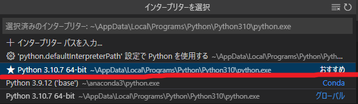
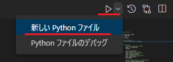
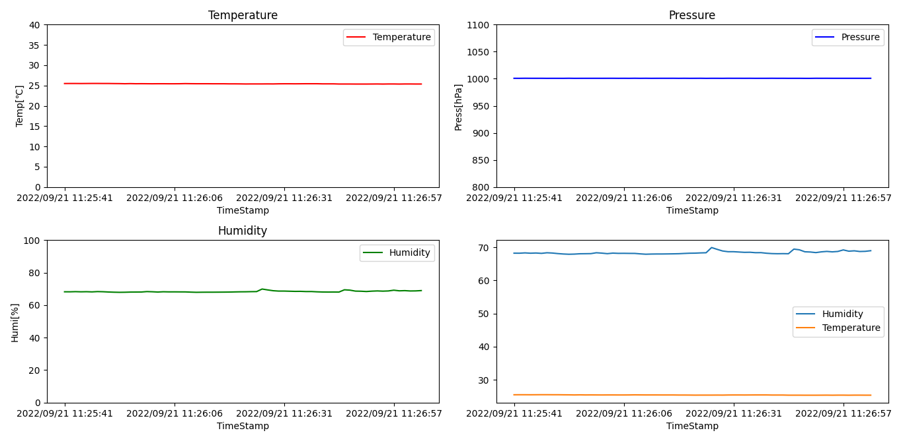

# プログラミング技術（Python入門）

## 統合開発環境（IDE）について（Visual Studio Code)

Visual Studio Code（VSCode）は、2015年にリリースされたMicrosoftが提供する開発用エディタです。ほぼ全ての言語に対応しており、かつオープンソースであるため、無償で使えます。Windows、Mac、LinuxなどのOSにも対応しています。


## Pythonのインストール

以下のアドレスからPythonをダウンロードし、インストールします。

*  <https://www.python.org/>

## 環境構築の準備

以下のアドレスからVSCodeをダウンロードし、インストールします。

* https://code.visualstudio.com/download

## 拡張機能のインストール

VSCode内のプライマリサイドバーの拡張機能から`japanese`と`Python`と検索し、VSCodeの日本語化とPythonの開発に必要な拡張機能をインストールします。その他Pylanceなどの機能も一緒にインストールされる。


## インタプリタの選択

VSCode内の上記タブから`ファイル`＞`フォルダを開く`

* フォルダ名：`pico_python`を開いてください。

その後、画像のように、pico_python1.pyをクリックしてください。

* ファイル名: `pico_python1.py`を開いてください。


インタプリタを右下の設定からPython 3.x.x 64-bitを選択します。※先にPythonファイルを開いてください。
* `C:\\Users\\user\\AppData\\Local\\Programs\\Python\\Python310\\python.exe`


この際、Anaconda環境またそれ以外のPython開発環境がPCにインストールされている場合は、別のPythonインタプリタが競合する場合があります。慣れていない方は、先にPCのアプリケーションのインストールから削除することをおすすめします。



## ライブラリのインストール作業

公式版のPythonには、今回使用する外部ライブラリである`Paddas`、`Matplotlib`及びRaspberry Pi Picoとシリアル通信でデータを受信するには、`Pyserial`ライブラリをインストールする必要があります。

VSCode上部のターミナルから新しいターミナルを開き、以下のコマンドを実行してください。


Windows PowerShellが画面にて以下のコマンドを打ちます。


- pipを最新版にアップデート

```shell
 pip install --upgrade pip
```
`Successfully uninstalled pip-x.x.x`とでれば成功

- Padansをインストール
```shell
 pip install pandas
```
`Successfully installed pandas-x.x`とでれば成功
 
- Matplotlibをインストール
```shell
 pip install matplotlib
```
`Successfully installed matplotlib-x.x`とでれば成功

- Pyserialをインストール

```shell
pip install pyserial 
```
`Successfully installed pyserial-x.x`とでれば成功

## Pythonでデータを受信する

pythonで、Picoから送られたデータ（温度、湿度、気圧）を受信します。同時にファイル名（test.csv）に、` (,) `カンマ区切りでデータを出力する。`[Ctrl+C]`キーを入力するとプログラムの実行を終了します。

- csvファイルの中身について

    
    - 現在時刻,温度,湿度,気圧
        
        - 2022/09/21 11:27:03,25.37,1000.86,68.95703

* ファイル名（pico_python1.py）

```python
# coding: utf-8
# pico_python1.py
from time import sleep
import datetime
import csv
import serial

#シリアルポートを設定
ser = serial.Serial('COM番号', 921600)

try:
    while True:
        ## 行終端'\r\n'までシリアル通信からデータを取得
        data = ser.readline()
        sleep(1)    #1sec待機

        #改行コードで分割
        data = data.split(b'\r\n')
        #バイナリデータを文字列に変換
        data = data[0].decode()
        #カンマで分割し、list型dataに格納
        data = data.split(',')
        print(data)
        
        #datetimeライブラリから現在の時刻を取得
        dt_now = datetime.datetime.now()
        #ファイル名(test.csv)を作成し、カンマ区切りで(現在時刻,温度,湿度,気圧)書き込む
        #with構文はopen,read,closeを省略して表記
        #'a'モードをファイルを作成し、追加で書き込む
        with open('test.csv', 'a') as f:
            f.write(dt_now.strftime('%Y/%m/%d %H:%M:%S') + "," + data[0]  + "," + data[1]  + "," + data[2] + "\n")
    
except KeyboardInterrupt:#キーを押して終了した時は何もしないでプログラムを終了する
    pass
```

`COM番号`には自身のPicoが接続されたCOM番号を入れる。

```python
ser = serial.Serial('COM10', 921600)
```

powershell画面で、pythonコードを実行します。

```shell
python pico_python1.py
```

以下のように新しいPythonファイルからのPythonコードを実行することができます。



成功すれば、以下のようにターミナル上に`['温度', '気圧', '湿度']`がシリアル通信で受信されて、表示されます。


なお、受信されたデータは、`test.csv`というファイル名のファイルが自動で生成されて、以下のように、データが書き込まれます。


## Pythonでcsvデータをグラフ化する

上記のプログラムで生成された`test.csv`ファイルを読み込んで`Pandas`と`Matplotlib`ライブラリを用いて、グラフによる可視化を行います。

* ファイル名（pico_python2.py）

```python
# pico_python2.py
import pandas as pd
# グラフ描画ライブラリ matplotlibのpyplotを plt という名前でimport
import matplotlib.pyplot as plt

#データフレームdfにcsvファイルからのデータにカラムの名前を付けて格納する
df = pd.read_csv('test.csv', names=("TimeStamp", "Temperature", "Pressure", "Humidity"),encoding='utf8')

#2x2=4つのグラフを作成する
fig, axes = plt.subplots(2,2,tight_layout=True)

#グラフそれぞれにx軸とy軸のデータ、色を指定し、プロットする
df.plot(ax=axes[0,0], x='TimeStamp', y=["Temperature"], color="red")
df.plot(ax=axes[0,1], x='TimeStamp', y=["Pressure"], color="blue")
df.plot(ax=axes[1,0], x='TimeStamp', y=["Humidity"], color="green")

#サブプロットにタイトル追加
axes[0,0].set_title("Temperature")
axes[0,1].set_title("Pressure")
axes[1,0].set_title("Humidity")

#サブプロットに軸ラベル追加
axes[0,0].set_ylabel("Temp[℃]")
axes[0,1].set_ylabel("Press[hPa]")
axes[1,0].set_ylabel("Humi[%]")

#サブプロットに軸範囲を追加
axes[0,0].set_ylim(0,40)
axes[0,1].set_ylim(800, 1100)
axes[1,0].set_ylim(0, 100)

#グラフの表示（jupyterだと不要）
plt.show()
```

powershell画面で、pythonコードを実行します。

```shell
python pico_python2.py
```

以下のグラフが描画されれば、成功です。

